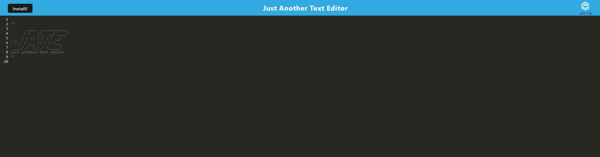
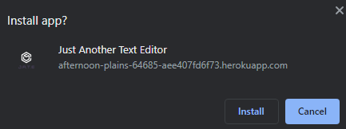

# PWA-Text-Editor

## Purpose of Task

Creation of a text editor that runs in the browser and can be used offline. This application meets the PWA (Progressive Web Application) criteria and can be installed on the user's device. Data is stored using IndexedDB. The application is deployed to Heroku.

## Table of Contents

- [Description](#description)

- [Link](#link)

- [Usage](#usage)

- [Screenshots](#screenshots)

## Description

JATE is a simple text editor that runs in the browser. Any text that is written is styled to look like JavaScript and is saved to IndexedDB within the user's browser whenever the page is not in focus. The application is a PWA and can be installed on the user's device using the **Install Button** in the header. The application uses caching and so it can be used offline, i.e. without an internet connection, after the initial visit.

## Link

The deployed application is available [here](https://afternoon-plains-64685-aee407fd6f73.herokuapp.com/)

## Usage

To run this application locally, first clone the repository and open it in your code editor. Open a new terminal and type the following command to install the required dependencies:

```sh
npm i
```

To start the server, type the following command in the terminal:

```sh
npm start
```

This will build the client side application to the **dist** folder and start the server.

To view the application, open your browser and go to http://localhost:3000

## Screenshots




